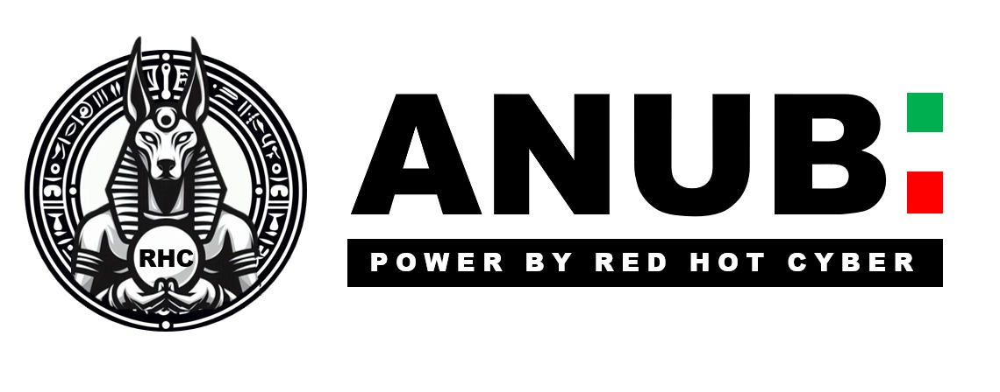
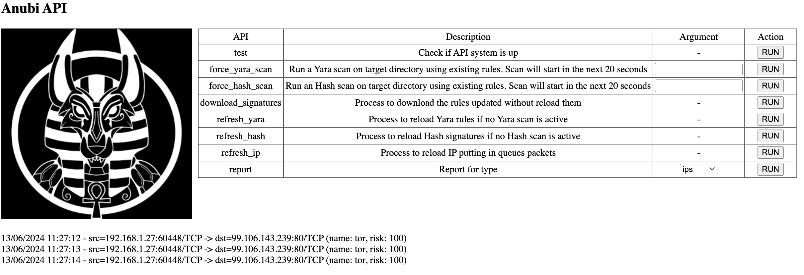
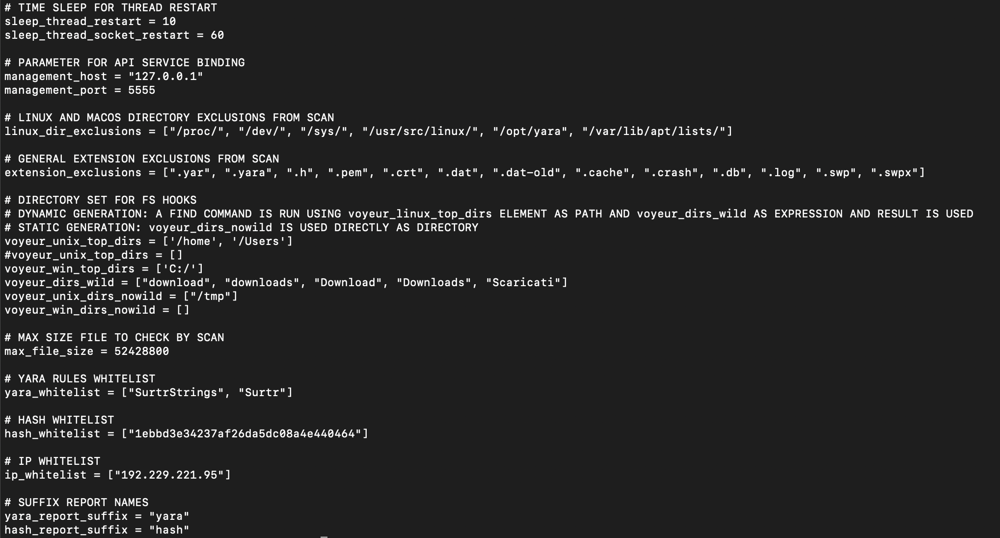

# Anubi
IOC/Hash scanner and IDS layer 4 portable and fast

Anubi is a tool designed and written in Python in order to be flexible and usable on different platforms.

## Functions
Anubi combines 5 different engines to check your assets:
1. IOC scanner
2. Hash scanner
3. IP check
4. Filesystem modifications (Voyeur)
5. API

These functionalities use a prepared set of rules available in [my repository](https://github.com/kavat/anubi-signatures) generated daily; even custom rules can be loaded.

### IOC scanner
IOC scan is a passive monitoring on the filesystem root applying Yara rules generated in [my official repo](https://github.com/kavat/anubi-signatures/tree/main/yara)

### Hash scanner
Hash scan is a passive monitoring on the filesystem root applying Hash rules generated in [my official repo](https://github.com/kavat/anubi-signatures/tree/main/hash)

### IP checker
IP checker is an active monitoring of a particular ethernet interface applying IP rules generated in [my official repo](https://github.com/kavat/anubi-signatures/tree/main/ips)

### Filesystem modifications (Voyeur)
Voyeur is an active monitoring on the filesystem directories specified applying [Yara](https://github.com/kavat/anubi-signatures/tree/main/yara) and [Hash](https://github.com/kavat/anubi-signatures/tree/main/hash) rules

### API
Anubi helps users with its own API system used to interact. 
Command to connect with API system `curl http://127.0.0.1:5555/api?func=help` provides available references:
* download_signatures, `http://127.0.0.1:5555/api?func=download_signatures` allows pulling from anubi-signatures repository for rules update without reload them in Anubi
* refresh_yara, `http://127.0.0.1:5555/api?func=refresh_yara` refreshes official and custom Yara rules
* refresh_hash, `http://127.0.0.1:5555/api?func=refresh_hash` refreshes official and custom Malware hash rules
* refresh_ip, `http://127.0.0.1:5555/api?func=refresh_ip` refreshes official and custom IP for network monitoring
* force_yara_scan, `http://127.0.0.1:5555/api?func=force_yara_scan&dir=url_encoded_dir` forces a yara scan (dir parameter shall be url-encoded)
* force_hash_scan, `http://127.0.0.1:5555/api?func=force_hash_scan&dir=url_encoded_dir` forces a hash scan (dir parameter shall be url-encoded)
* report, `http://127.0.0.1:5555/api?func=report&dir=report_type` requires and prints the report for the current day for the selected type (yara, hash, voyeur or ips)

User is helped by a simply webui in order to interact with Anubi (as default console is reacheable at http://127.0.0.1:5555)

## OS supported
Linux, MacOS and Windows

## Dependencies
External dependencies are needed:
* WinPcap
  * Windows: follow [official documentation](https://www.winpcap.org/install/)
* Git
  * Linux (Debian): `apt install git-core`
  * Linux (Centos): `yum install git-core`
  * MacOS: `brew install git`
  * Windows: follow [official documentation](https://git-scm.com/download/win)
* Python3
  * Linux (Debian): `apt install python3`
  * Linux (Centos): `yum install python3`
  * MacOS: `brew install python3`
  * Windows: follow [official documentation](https://www.python.org/downloads/windows/)
* Python3 Pip
  * Linux (Debian): `apt install python3-pip` or `python3 -m ensurepip`
  * Linux (Centos): `yum install python3-pip` or `python3 -m ensurepip`
  * MacOS: `python3 -m ensurepip`
  * Windows: Pip will be install with Python3 installation, follow [official documentation](https://www.python.org/downloads/windows/)
* YARA
  * Linux/Windows: follow [official documentation](https://yara.readthedocs.io/en/stable/gettingstarted.html) 
  * MacOS: `brew install yara`
* SSHFs
  * Linux (Debian): `apt install sshfs`
  * Linux (Centos): `yum install sshfs`
* SYft
  * Linux (Debian): `apt install syft`
  * Linux (Centos): `yum install syft`

Relating to Pip modules, user can install dependecies through `pip install -r pip_requirements.txt`

**Attention**: running Anubu some errors can appear, as below
`yara.SyntaxError: ......./anubi/conf/anubi-signatures/yara/RANSOM_BadRabbit.yar(35): invalid field name "imphash"`
this happen because yara-python or yara needs to be installed after or with the compilation support of other libraries, such libssl-dev for this particular case

## Run
Anubi is developed to be run on Linux and Mac, further release will provides same functions on Windows.

In order to print full options, run Anubi with --help; the following options will be returned:

In details, options available are the following:
*  -h, --help                 show this help message and exit
*  --check-conf               Check current configuration
*  --check-struct             Check Anubi directory structure
*  --create-struct            Create Anubi directory structure
*  --init                     Init configuration
*  --start                    Start Anubi with configuration created and rules already present
*  --start-full               Start Anubi with configuration created downloading last rules
*  --wipe                     Wipe Anubi logs
*  --refresh-yara             Reload yara rules, this action will use the already present ones, please download the newest before
*  --refresh-hash             Reload hash rules, this action will use the already present ones, please download the newest before
*  --refresh-ip               Reload IP, this action will use the already present ones, please download the newest before
*  --file FILE                File to check fullpath
*  --dir DIR                  Directory to check fullpath
*  --ip-remote IP_REMOTE      Remote IP to check through SSH
*  --user-remote USER_REMOTE  User to use for checking IP remote through SSH

Remember to run always as **root** user!

In order to start and control our assets, follow the flow below:
* clone repo
* install dependencies
* run Anubi with --start-full

During first time start Anubi will ask for its internal set up, as:
* periodic IOC/malware scan
* live network activities monitoring
* particular directories hooks where IOC and malware detections will started on file creation/modification events.

In case of error during rules loading process, only the line with error will be discarded, not the entire file.

## conf_anubi.py
File conf_anubi.py contains personal settings usable by user to customize Anubi, as below:

## Scan process
Periodical or on-demand scans are executed parallel and output can be visualized at screen or in specific file in path reports

## Whitelisting
Anubi allows to whitelist:
* Yara rules
* Hash
* IP

only adding them in conf_anubi.py in specific whitelist:
* Yara rules specified by name (example Certutil_Decode_OR_Download) in yara_whitelist
* Hash (example 1ebbd3e34237af26da5dc08a4e440464) in hash_whitelist
* IP (example 1.1.1.1) in ip_whitelist

## Notifications
Anubi is able to launch notifications in desktop environments, using py-notifier library. Notification is fired when:
* IOC for periodic scan, on-demand scan or Voyeur is detected
* Malware for periodic scan, on-demand scan or Voyeur is detected
* IP marked as malicious is detected in network activity

